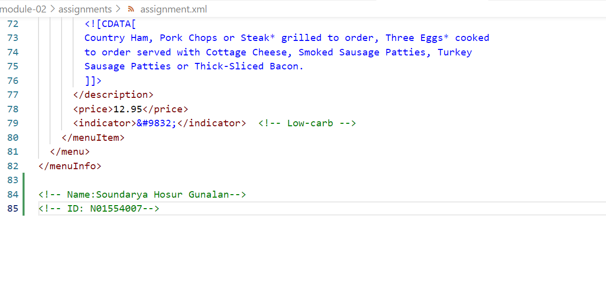
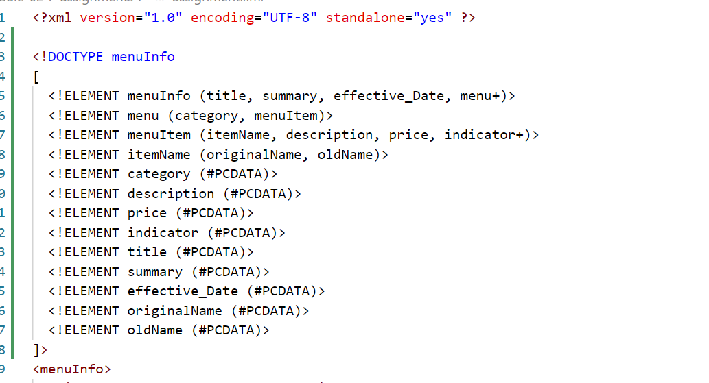
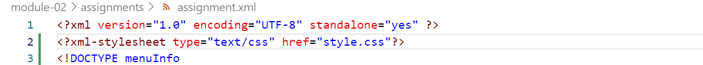

# Assignment 1: Theory Answers

1. There was a pace between the name of the element which is an error.

2. CDATA gives the descriptive explanation about the breakfast menu at Chesters.
It explains about the ingredients and the process of serving them.

3.Similar to HTML, we can add comments to XML using <!-- --> brackets

4. 
=> Prolog :Contains the xml declaration , DOCTYPE and possible comments.In this file DOCTYPE and COmments are not there in prolog

=> Document Body : In this XML everything inside <menuInfo> & </menuInfo> acts as a body

=> Processing Instruction : XML declaration and XML stylesheet information acts as processing instruction

=>  Epilog : Epilog contains the single new line (#A) character followed by > which represents end of the root elements tag.
Itb is not present in this document.

5. 

7. 

