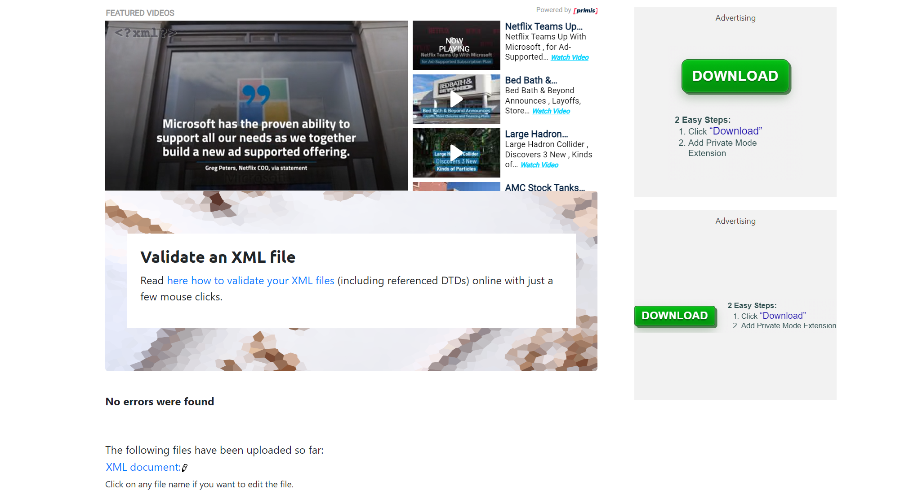

2.XML DTD Validation

3.XML XSD Validation
 

4.
=> We can see here in the information given that, we just have to clarify the size. Because size is the only element in this information summary that we need to give it (+) symbol and it will be in the range of 0 to more.
=> We have to put #REQUiRED in the required field in assignment file.
=> Same way, we have to apply on all of these elements of assignment file.

=> XSD file defines and describes the elements in the assignment.xml. 
